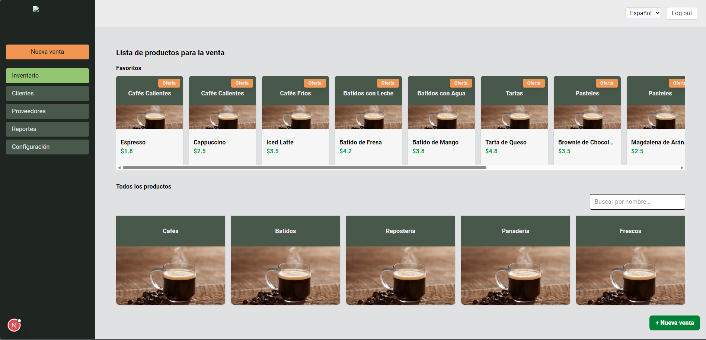
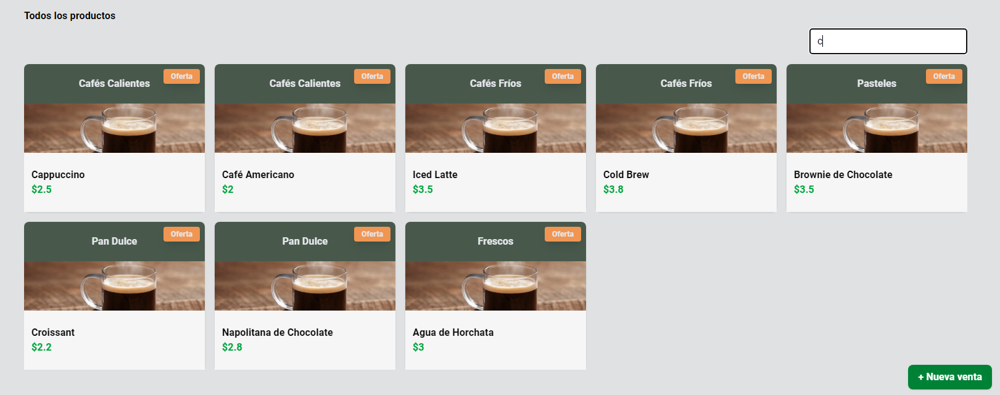
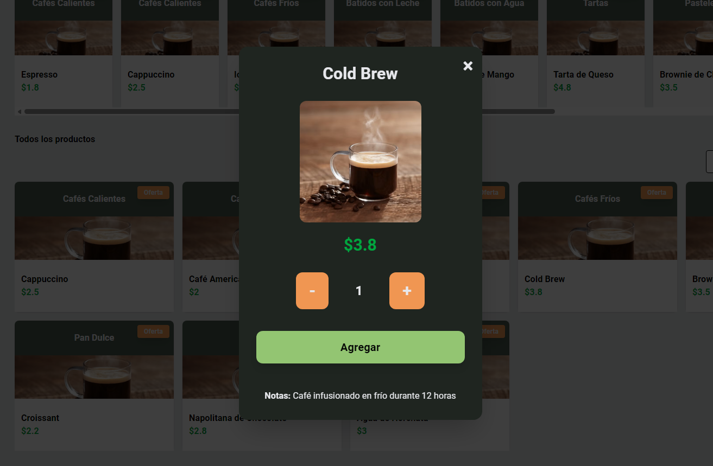

# Negozia360 PoC

A modern Point-of-Sale (POS) dashboard concept focused on fast sales flow, product navigation, and multi-sale management.

This is a portfolio-ready frontend project built to showcase practical product development skills for real business workflows.

The product vision is to provide a highly customizable interface, especially around branding. For that reason, the UI theme is driven by CSS variables (including primary and secondary colors), making visual adaptation fast and scalable.

## Why this project stands out

- End-to-end UX flow for sales operations
- Clean and scalable component architecture
- Typed state management with Redux Toolkit
- Internationalization support (ES/EN)
- CI/CD-ready static deployment to GitHub Pages

---

## Screenshots

> Replace these placeholders with your final images.

### 1) Main Sales Dashboard



### 2) Product Search and Catalog



### 3) Product Detail



### 4) Active Sale Summary


---

## Product Overview

Negozia360 PoC simulates a sales environment where users can:

- Navigate product categories and subcategories
- Add products to an active sale
- Manage multiple pending sales in parallel
- Track totals and quantities in real time
- Switch language context (Spanish/English)

---

## Tech Stack

- **Framework:** Next.js 15 (App Router)
- **UI:** React 19, Tailwind CSS, Material UI
- **Language:** TypeScript (strict mode)
- **State Management:** Redux Toolkit + React Redux
- **i18n:** next-intl
- **HTTP Client:** Axios
- **Quality:** ESLint + Next.js core-web-vitals rules

---

## Architecture

- **App shell:** `src/app/layout.tsx`
- **State layer:** `src/lib/store`
- **Feature modules:** `src/components/features/sale`
- **Utilities:** `src/lib/utils`
- **Mock data:** `src/mocks/productMocks.ts`

This codebase follows a feature-oriented structure and typed hooks to keep maintainability high as the project grows.

Design customization is intentionally centralized through CSS variables so teams can adjust primary/secondary colors and theme accents without rewriting components.

---

## Theming Strategy

To support white-label branding, the UI uses CSS custom properties as design tokens, with focus on primary and secondary color roles.

```css
:root {
	--color-primary: #2563eb;
	--color-secondary: #10b981;
}
```

Components consume these variables instead of hardcoded values, so teams can rebrand quickly by updating a small set of tokens.

| Token | Purpose |
| --- | --- |
| `--color-primary` | Main brand color for primary actions and highlights |
| `--color-secondary` | Secondary brand color for support actions and accents |
| `--color-text` | Default text color for content readability |
| `--color-background` | Base background color for app surfaces |

---

## Local Setup

### Prerequisites

- Node.js 20+
- npm

### Run locally

```bash
npm install
npm run dev
```

Open `http://localhost:3000`.

### Scripts

- `npm run dev` — Start development server
- `npm run build` — Create production build / static export
- `npm run start` — Start production server (non-static environments)
- `npm run lint` — Run ESLint checks

---

## Deployment (GitHub Pages)

This repository is configured for static export (`output: "export"`) and automated deployment via GitHub Actions.

1. Push the repository to GitHub
2. Ensure your default branch is `main`
3. Go to **Settings → Pages**
4. Set **Source** to **GitHub Actions**
5. Push to `main` to trigger `.github/workflows/deploy-pages.yml`

### Notes

- For `username.github.io`, the app is served from `/`
- For project repos (e.g. `negozia360-poc`), basePath is automatically set to `/<repo>`
- You can override basePath with `PAGES_BASE_PATH` in workflow variables

---

## Recruiter Snapshot

This project demonstrates:

- Production-style React architecture
- State modeling and UI synchronization with Redux Toolkit
- Strong TypeScript discipline in a real UI workflow
- Deployment automation and release readiness

---

## Next Improvements

- Backend integration (products, customers, orders)
- Authentication and role-based permissions
- Persistent storage and offline mode
- Automated unit/integration tests
- Accessibility and performance audits
